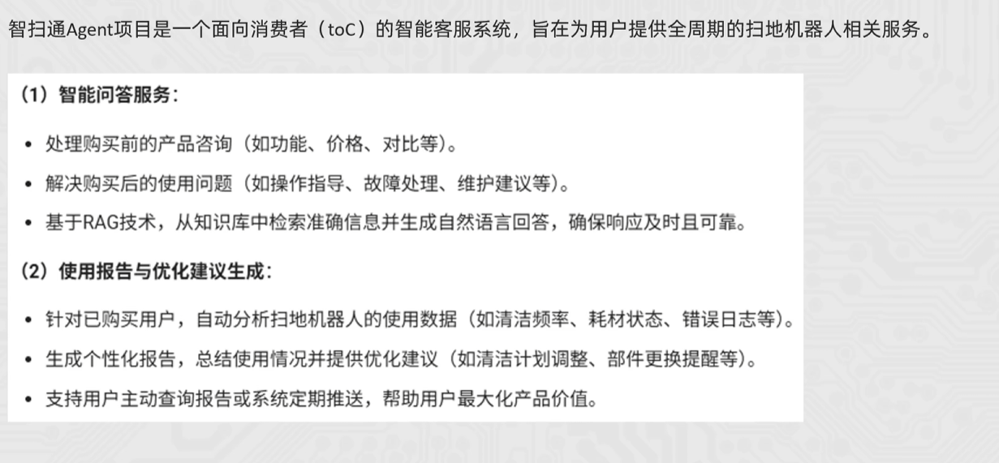
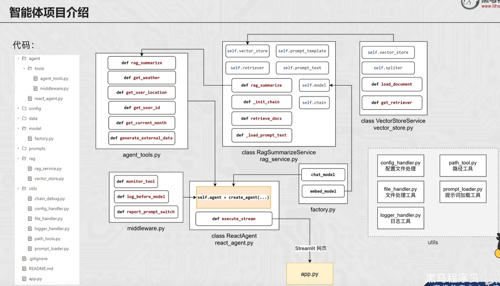

# agent_project

一个面向扫地机器人与扫拖一体机器人场景的智能客服 Agent 项目。项目正在逐步搭建基于 RAG（检索增强生成）的问答流程，将领域知识、用户使用记录和提示词配置分离，便于后续扩展知识库检索、个性化报告生成及多工具协作能力。

## 主要功能

- 管理系统提示词、RAG 总结提示词和报告生成提示词
- 加载 PDF、TXT 等领域知识文件
- 通过 MD5 标识文件，为知识库去重提供基础能力
- 使用 YAML 集中管理模型、向量库、数据路径和文本切分参数
- 记录程序运行日志
- 保存扫地机器人知识资料与用户月度使用记录示例

## 项目结构

```text
agent_project/
├── config/          # 模型、提示词、向量库和 Agent 配置
├── data/            # PDF/TXT 知识资料及外部用户记录
├── prompts/         # 系统、RAG 总结和报告生成提示词
├── rag/             # RAG 与向量库相关代码
├── utils/           # 配置、文件、日志、路径和提示词工具
├── projcet_intro.png
└── project_structure.png
```

## 环境准备

建议使用 Python 3.10 或更高版本，并在虚拟环境中安装当前代码使用的基础依赖：

```bash
pip install PyYAML langchain-core langchain-community pypdf
```

## 快速运行

在项目根目录执行：

```bash
python utils/prompt_handler.py
```

该命令会读取 `config/prompts.yml` 中的配置，并输出报告生成提示词。

## 核心配置

- `config/rag.yml`：知识文件类型、切分参数、检索数量及持久化目录
- `config/chroma.yml`：向量集合配置
- `config/prompts.yml`：提示词文件路径
- `config/agent.yml`：聊天模型、嵌入模型等 Agent 配置

## 项目状态

当前仓库处于开发阶段，已完成配置管理、提示词管理、文件加载和日志等基础模块；向量库构建、检索链路及完整 Agent 调度流程仍在持续完善中。

## 项目预览




